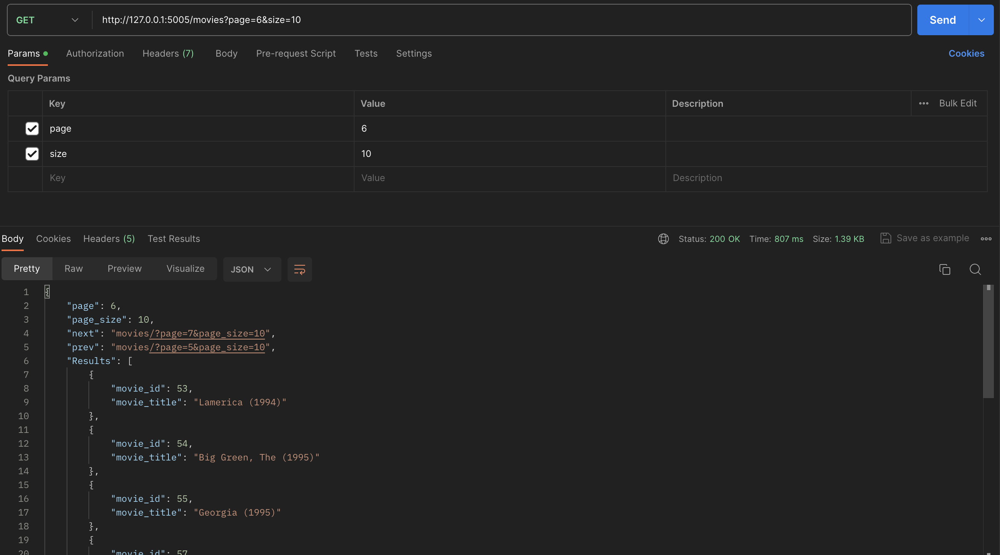
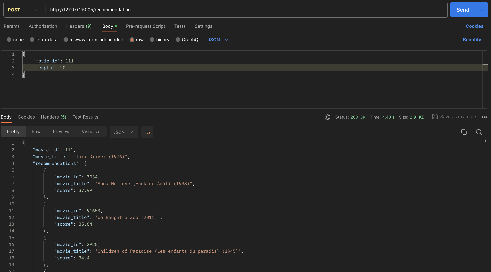

# spk_web
## Install, create and activate virtualenv
https://medium.com/analytics-vidhya/virtual-environment-6ad5d9b6af59

## Install requirements

    pip install -r requirements.txt

## Run the app
to run the web app simply  use

    python main.py

## Usage
Install postman 
https://www.postman.com/downloads/

get movie list

get recommendations

ref:
https://en.wikipedia.org/wiki/Pearson_correlation_coefficient

### TUGAS UAS
Implementasikan model yang sudah anda buat ke dalam web api dengan http method `POST`, contoh implemantasinya dapat dilihat pada repositori ini untuk api recommendation, 

contoh body request (bobot) :

    { 
    	"kriteria_1": 1,
    	 "kriteria_2": 2, 
    	 "kriteria_3": 5
    	 }

contoh output (diurutkan / sort dari yang terbesar ke yang terkecil):

    {
    	"alternatif_1": 30.0,
    	"alternatif_2": 27.5,
    	"alternatif_3": 25.5,
    	"alternatif_4": 20.0
    	}

